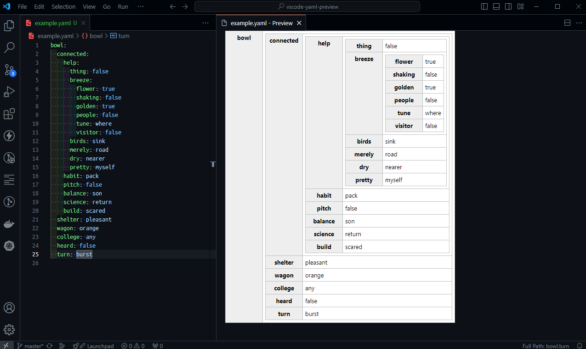

# vscode-yaml-preview

Documents written in YAML format can be previewed in real time on VS Code as a table.

## How to use

- Open any `YAML` file.
- Type `CTRL+SHIFT+P` and search for 'yaml'.
- Choose either `Yaml:Open preview` or `Yaml:Open preview to the side`

#### Honorable mention
> This extension was based on the original solution provided [here](https://github.com/daiwata/vscode-yaml-preview).

