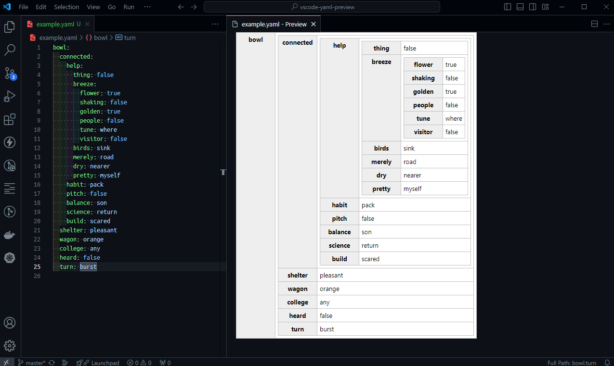

# Yaml2Table Preview

This VSCode extension helps to preview the documents written in YAML format to be previewed in real time on VS Code as a table.

## Download Extension

Download here: [Yaml2Table Preview - Visual Studio | Marketplace](https://marketplace.visualstudio.com/items?itemName=adautomendes.yaml2table-preview)

## Sample Screenshot

## How to use

- Open any `YAML` file.
- Type `CTRL+SHIFT+P` and search for 'Yaml2Table'.
- Choose either `Yaml2Table:Open preview` or `Yaml2Table:Open preview to the side`

### Open Preview

`Yaml2Table:Open preview` - opens the preview in a new tab and focuses on it as below

### Open Preview to the Side

 `Yaml2Table:Open preview to the side` - opens the preview in a new tab on the side. 
 The file and preview will be visible side by side as below

#### Honorable mention
> This extension was based on the original solution provided [here](https://github.com/daiwata/vscode-yaml-preview).
